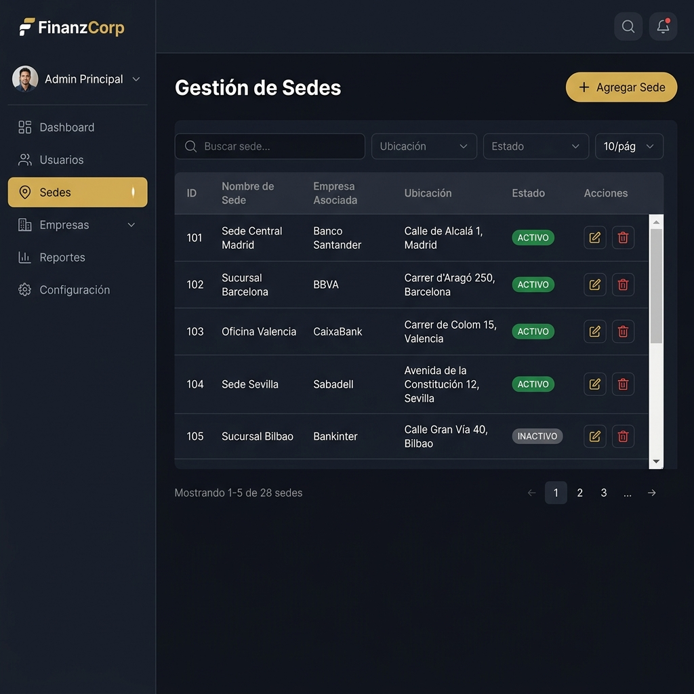
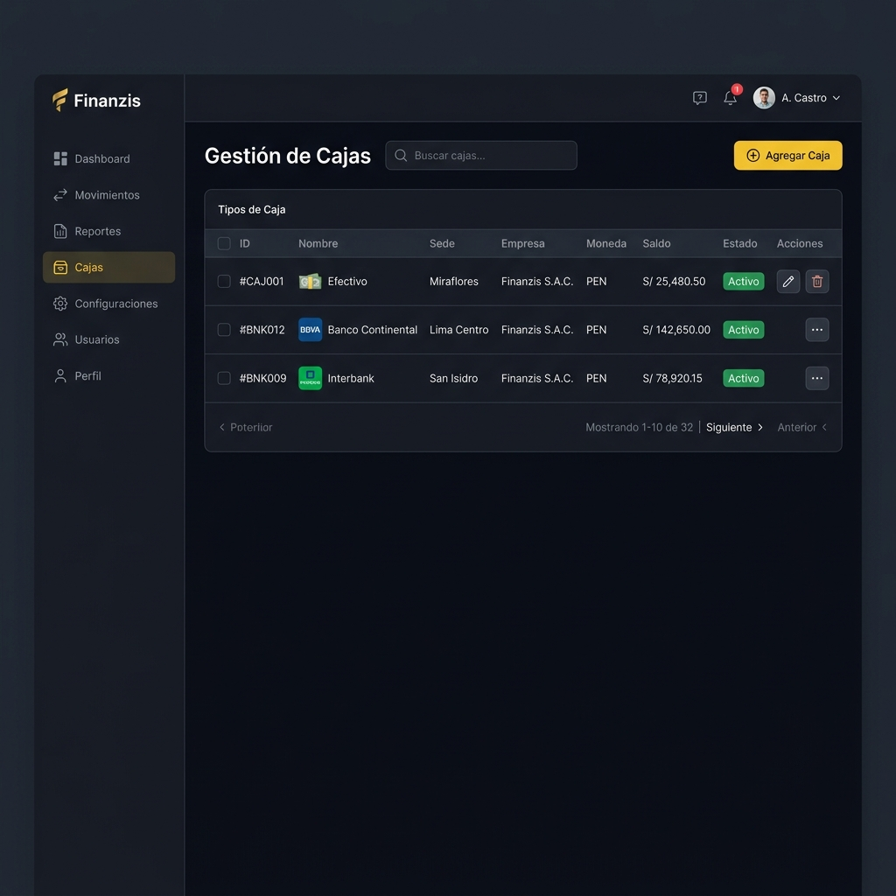

<div align="center">

# 🏦 SISTEMA FINANCIERO CORPORATIVO

### Manual de Usuario, Operaciones y Guía Técnica

[](https://react.dev/)
[](https://www.typescriptlang.org/)
[](https://vitejs.dev/)
[](https://tailwindcss.com/)

*Plataforma web centralizada para el control estricto de flujo de dinero, gestión de contribuyentes y administración multi-sede.*

</div>

---

## 📖 ÍNDICE DE CONTENIDOS

| N° | Capítulo | Descripción |
|----|----------|-------------|
| 1 | [Introducción y Conceptos](#-capítulo-1-introducción-y-conceptos-básicos) | Roles, glosario y arquitectura del sistema |
| 2 | [Acceso al Sistema (Login)](#-capítulo-2-acceso-al-sistema-login) | Inicio de sesión y recuperación de contraseña |
| 3 | [Navegación y Sidebar](#-capítulo-3-navegación-y-sidebar) | Estructura de menús por rol |
| 4 | [Dashboard del Administrador](#-capítulo-4-dashboard-del-administrador) | Panel de control, gráficos y estadísticas |
| 5 | [Dashboard del Cajero](#-capítulo-5-dashboard-del-cajero) | Panel operativo del cajero |
| 6 | [Módulo de Movimientos](#-capítulo-6-módulo-de-movimientos) | Registro de ingresos, egresos y tabla de historial |
| 7 | [Gestión de Contribuyentes](#-capítulo-7-gestión-de-contribuyentes) | Directorio, teléfonos, documentos y credenciales |
| 8 | [Bandeja de Aprobaciones](#-capítulo-8-bandeja-de-aprobaciones-administrador) | Flujo de autorización de egresos |
| 9 | [Configuración del Sistema](#-capítulo-9-configuración-del-sistema-administrador) | Empresas, Sedes, Cajas, Usuarios y Comprobantes |
| 10 | [Reportes PDF](#-capítulo-10-reportes-y-exportación-pdf) | Generación de informes con membrete |
| 11 | [Guía Técnica para Desarrolladores](#-capítulo-11-guía-técnica-para-desarrolladores) | Stack, instalación y arquitectura |
| 12 | [FAQ - Preguntas Frecuentes](#-capítulo-12-faq---preguntas-frecuentes) | Solución de problemas comunes |

---

## 🏛️ CAPÍTULO 1: INTRODUCCIÓN Y CONCEPTOS BÁSICOS

El **Sistema Financiero Corporativo** es una plataforma web desarrollada en `React + Vite + TypeScript` diseñada para llevar el control estricto del flujo de dinero (ingresos y egresos), la base de datos de clientes/proveedores, y la arquitectura organizativa de una empresa con múltiples sucursales (Sedes) y personerías jurídicas (Empresas).

### 1.1. Jerarquía de Roles

El sistema se divide en **dos niveles de seguridad**:

| Rol | Nivel | Permisos Clave |
|-----|-------|----------------|
| **Administrador** | Nivel 1 | Acceso irrestricto. Crea usuarios, configura empresas, sedes, cajas. Aprueba o rechaza transacciones sensibles. Ve todas las sedes. |
| **Cajero / Operador** | Nivel 2 | Perfil operativo. Registra movimientos en su caja asignada, crea contribuyentes. Sus egresos importantes requieren autorización del Admin. Solo ve su sede asignada. |

### 1.2. Glosario del Sistema

| Término | Definición |
|---------|------------|
| **Sede** | Ubicación física de una sucursal (ej. "Oficina Miraflores", "Sede San Isidro"). |
| **Empresa** | Razón Social / RUC con la que opera financieramente (puede haber varias bajo un mismo grupo). |
| **Tipo de Caja** | Clasificación lógica del dinero: Caja Efectivo, Cuenta Corriente de Banco, Caja Fuerte. |
| **Contribuyente** | Persona natural o jurídica que da o recibe dinero: Cliente, Proveedor, Empleado. |
| **Movimiento** | Una transacción financiera. Puede ser **Ingreso** (suma saldo) o **Egreso** (resta saldo). |
| **Comprobante** | Documento tributario asociado al movimiento: Factura, Boleta, Recibo de Egresos. |
| **Rubro** | Clasificación económica de un contribuyente, ligada a tasas de detracción SUNAT. |

---

## 🔑 CAPÍTULO 2: ACCESO AL SISTEMA (LOGIN)

La puerta de entrada a la plataforma. Toda la comunicación está cifrada de punto a punto.

<div align="center">


*Pantalla de inicio de sesión del sistema*

</div>

### 2.1. Campos del Formulario de Login

| Campo | Descripción | Ejemplo |
|-------|-------------|---------|
| **Correo Electrónico** | Correo corporativo registrado por el administrador. | `cajero01@empresa.com` |
| **Contraseña** | Si es tu primer ingreso, usa la contraseña temporal entregada por tu administrador. | `••••••••` |

### 2.2. Comportamiento del Login
- Al iniciar sesión con éxito, el sistema detecta automáticamente tu **rol** y te redirige:
  - **Admin** → `/admin/dashboard`
  - **Cajero** → `/cajero/dashboard`
- Si la contraseña es incorrecta, se muestra un mensaje de error claro.
- Existe una opción de **"¿Olvidaste tu contraseña?"** que permite la recuperación vía correo electrónico.

---

## 🧭 CAPÍTULO 3: NAVEGACIÓN Y SIDEBAR

El menú lateral izquierdo (Sidebar) es el centro de navegación del sistema. Se adapta dinámicamente al rol del usuario.

<div align="center">


*Menú lateral con todos los módulos del sistema (vista Administrador)*

</div>

### 3.1. Estructura del Sidebar

| Sección | Descripción |
|---------|-------------|
| **Perfil de Usuario** | Foto de perfil (editable al hacer clic), nombre completo, rol ("Administrador" o "Cajero"), y sede asignada. |
| **Dashboard** | Acceso directo al panel de control con gráficos y estadísticas. |
| **Contribuyentes** *(desplegable)* | Sub-menú con: Lista de Contribuyentes, Rubros, Tipos de Credenciales, Tipos de Teléfono, Tipos de Documentos. |
| **Configuración** *(solo Admin, desplegable)* | Sub-menú con: Usuarios, Sedes, Tipos de Caja, Empresas, Movimientos (Aprobaciones). |
| **Movimientos** *(solo Cajero)* | Acceso directo al historial y registro de transacciones. |
| **Modo Claro / Oscuro** | Toggle para cambiar el tema visual del sistema completo. |
| **Cerrar Sesión** | Cierra la sesión y redirige al Login. |

### 3.2. Menú del Cajero vs Administrador

| Funcionalidad | Admin | Cajero |
|---------------|:-----:|:------:|
| Dashboard | ✅ | ✅ |
| Lista de Contribuyentes | ✅ | ✅ |
| Rubros | ✅ | ❌ |
| Tipos de Credenciales | ✅ | ❌ |
| Tipos de Teléfono | ✅ | ❌ |
| Tipos de Documentos | ✅ | ❌ |
| Usuarios | ✅ | ❌ |
| Sedes | ✅ | ❌ |
| Tipos de Caja | ✅ | ❌ |
| Empresas | ✅ | ❌ |
| Aprobaciones / Movimientos | ✅ | ❌ |
| Movimientos (registro) | ❌ | ✅ |

---

## 📊 CAPÍTULO 4: DASHBOARD DEL ADMINISTRADOR

El panel central de inteligencia financiera. Aquí el administrador tiene visibilidad total del estado económico de **todas las sedes y cajas**.

<div align="center">


*Vista panorámica del Dashboard del Administrador*

</div>

### 4.1. Tarjetas de Resumen Superior

| Tarjeta | Descripción | Indicador |
|---------|-------------|-----------|
| **Saldo Total** | Sumatoria del saldo actual de todas las cajas activas en todas las sedes. | Flecha verde (↑) si subió vs ayer, roja (↓) si bajó. |
| **Ingresos del Día** | Total de depósitos, cobranzas y entradas de dinero registradas hoy. | Monto en Soles (S/). |
| **Egresos del Día** | Total de pagos, retiros y salidas de dinero del día. | Monto en Soles (S/). |
| **Operaciones** | Cantidad total de transacciones procesadas hoy. | Número entero. |

### 4.2. Gráficos Interactivos

El dashboard incluye **dos gráficos** de área con degradado que permiten interacción:

| Gráfico | Descripción |
|---------|-------------|
| **Flujo Neto** | Muestra la evolución del flujo neto (Ingresos - Egresos) a lo largo del tiempo. Gráfico de área azul con degradado. |
| **Evolución por Caja** | Muestra la evolución del saldo de cada caja individual con colores diferenciados y áreas con degradado. |

#### Funcionalidades de los gráficos:
- **Selector Histórico / Mensual:** Un dropdown permite alternar entre la vista completa desde el inicio del sistema o solo el mes en curso.
- **Expansión In-line:** Al hacer **clic** sobre cualquier gráfico, este se expande ocupando todo el ancho del contenedor (sin ventana emergente). Se muestra un botón "X" para volver al tamaño normal.
- **Fechas inteligentes:** El eje X usa `minTickGap` para evitar superposición de etiquetas de fecha.
- **Tooltips Premium:** Al pasar el cursor sobre un punto del gráfico, se muestra el monto formateado con sombra y bordes redondeados.

### 4.3. Distribución de Capital

Gráficos circulares (Pie Charts) que muestran:
- **Saldos por Empresas:** Distribución porcentual del capital entre las diferentes razones sociales.
- **Saldos por Sedes:** Distribución porcentual del capital entre las sucursales físicas.

### 4.4. Actividad Reciente

Una tabla compacta que muestra los últimos movimientos registrados en todo el sistema, con columnas de Fecha, Tipo, Monto, Cajero y Estado.

---

## 💰 CAPÍTULO 5: DASHBOARD DEL CAJERO

El panel operativo del día a día. Solo muestra la información de la **sede asignada al cajero**.

<div align="center">


*Vista del Dashboard del Cajero con gráficos y resumen de saldo*

</div>

### 5.1. Tarjeta Principal de Saldo

| Elemento | Descripción |
|----------|-------------|
| **Saldo Actual** | Monto en grande mostrando el saldo total de la caja asignada. |
| **Variación** | Porcentaje de cambio respecto al día anterior con flecha de tendencia. |
| **Ingresos** | Sub-tarjeta verde con el total de entradas del día. |
| **Egresos** | Sub-tarjeta roja con el total de salidas del día. |

### 5.2. Gráficos del Cajero

Misma funcionalidad que el Admin pero filtrada únicamente a las cajas y datos de la sede del cajero:
- **Flujo Neto Histórico/Mensual** con gráfico de área azul degradado.
- **Evolución por Caja** con múltiples áreas de colores degradados.
- Expansión in-line al hacer clic y selector de modo (Histórico/Mensual).

---

## 💵 CAPÍTULO 6: MÓDULO DE MOVIMIENTOS

El corazón operativo del sistema. Aquí se registran todas las transacciones financieras.

<div align="center">


*Vista del historial de movimientos con filtros y paginación*

</div>

### 6.1. Filtros Disponibles

| Filtro | Descripción |
|--------|-------------|
| **Sede** | Filtra movimientos por sucursal. |
| **Empresa** | Filtra por razón social / RUC. |
| **Caja** | Filtra por caja específica (Efectivo, Banco, etc.). |
| **Fecha Inicio / Fin** | Rango de fechas para acotar el historial. |
| **Buscador** | Búsqueda rápida por concepto, contribuyente o N° de comprobante. |

### 6.2. Columnas de la Tabla

| Columna | Descripción |
|---------|-------------|
| **N°** | Número de orden correlativo. |
| **Fecha** | Fecha y hora del registro de la transacción. |
| **Tipo** | Badge de color: 🟢 INGRESO (verde) o 🔴 EGRESO (rojo). |
| **Monto** | Cantidad en Soles (S/) con formato de miles y decimales. |
| **Contribuyente** | Nombre/Razón Social del cliente o proveedor. |
| **Comprobante** | Tipo y número del documento tributario (Ej. `F001-000034`). |
| **Concepto** | Descripción detallada de la operación. |
| **Estado** | 🟢 Aprobado, 🟡 Pendiente, 🔴 Rechazado. |

### 6.3. Formulario: Registrar Nuevo Movimiento

Al presionar el botón **"Nuevo Movimiento"**, se abre un modal con los campos requeridos:

<div align="center">


*Formulario modal para registrar un nuevo ingreso o egreso*

</div>

| Campo | Tipo | Obligatorio | Descripción |
|-------|------|:-----------:|-------------|
| **Tipo de Movimiento** | Dropdown | ✅ | Selecciona `INGRESO` o `EGRESO`. |
| **Monto** | Numérico | ✅ | Valor de la transacción (no acepta negativos). |
| **Moneda** | Dropdown | ✅ | Soles (PEN) o Dólares (USD). |
| **Contribuyente** | Buscador | ✅ | Escribe RUC/DNI y el sistema autocompleta. |
| **Tipo de Comprobante** | Dropdown | ✅ | Factura, Boleta, Recibo de Egresos, etc. |
| **N° de Comprobante** | Texto | ✅ | Serie y correlativo (Ej. `F001-000034`). |
| **Concepto** | Textarea | ✅ | Descripción justificada de la operación. |
| **Imagen / Adjunto** | Archivo | Según regla | Foto del recibo o comprobante físico. |

> ⚠️ **Regla de negocio:** Si un Cajero registra un **EGRESO** que supera el umbral configurado, el movimiento quedará en estado `PENDIENTE` hasta que el Administrador lo apruebe desde la Bandeja de Aprobaciones.

### 6.4. Botones de Acción

| Botón | Color | Función |
|-------|-------|---------|
| **GUARDAR** | Dorado (#C4933F) | Confirma y registra el movimiento. |
| **DESCARTAR** | Gris | Cancela sin hacer cambios. |

---

## 📇 CAPÍTULO 7: GESTIÓN DE CONTRIBUYENTES

Módulo completo para administrar el ciclo de vida de clientes, proveedores y personal externo.

### 7.1. Directorio Principal de Contribuyentes

<div align="center">


*Directorio principal con búsqueda y paginación*

</div>

| Columna | Descripción |
|---------|-------------|
| **ID** | Identificador único interno del sistema. |
| **RUC / DNI** | Documento de identidad tributaria o personal. |
| **Razón Social** | Nombre completo de la empresa o persona. |
| **Correo** | Correo electrónico de contacto. |
| **Estado** | Badge 🟢 Activo o 🔴 Inactivo. |
| **Acciones** | Botones para editar, ver detalle o gestionar sub-módulos. |

### 7.2. Formulario de Nuevo Contribuyente

<div align="center">


*Modal para registrar un nuevo contribuyente*

</div>

| Campo | Tipo | Obligatorio | Descripción |
|-------|------|:-----------:|-------------|
| **Tipo de Documento** | Dropdown | ✅ | DNI o RUC. |
| **Número de Documento** | Texto | ✅ | El DNI (8 dígitos) o RUC (11 dígitos). |
| **Nombres / Razón Social** | Texto | ✅ | Identificador principal. Si hay conexión SUNAT/RENIEC, se autocompleta. |
| **Correo Electrónico** | Email | ❌ | Para notificaciones y contacto. |
| **Dirección Fiscal** | Textarea | ❌ | Domicilio fiscal oficial. |
| **Estado** | Toggle | ✅ | Activo o Inactivo. |

### 7.3. Sub-Módulos del Contribuyente

Al seleccionar un contribuyente, se accede a sus módulos secundarios:

#### 📞 Teléfonos y Contactos
Permite registrar múltiples números por contribuyente.

| Campo | Descripción |
|-------|-------------|
| **Número** | Teléfono fijo o celular (ej. 987654321). |
| **Tipo de Línea** | Celular, Fijo, WhatsApp, Otro. |
| **Nombre de Contacto** | Persona específica que atiende (ej. "Juan - Cobranzas"). |
| **Descripción / Área** | Para qué se usa esta línea (ej. "Área de Pagos"). |
| **Principal** | Checkbox que marca si es la vía de comunicación oficial. |

#### 📄 Documentos Digitales
Repositorio en la nube para almacenar evidencias (Fichas RUC, DNI escaneado, Contratos).

| Campo | Descripción |
|-------|-------------|
| **Nombre del Documento** | Título descriptivo (ej. "Contrato Marco 2026"). |
| **Tipo de Documento** | Categoría (Ficha RUC, Contrato, DNI, etc.). |
| **Rubro** | Clasificación económica (opcional). |
| **Archivo Adjunto** | Carga de archivo PDF, JPG o PNG desde tu PC. |

#### 🔐 Credenciales Confidenciales
Caja fuerte virtual de accesos a plataformas externas.

| Campo | Descripción |
|-------|-------------|
| **Sistema / Entidad** | Plataforma (Clave SOL SUNAT, AFP Net, etc.). |
| **Usuario** | ID de acceso a la plataforma. |
| **Contraseña** | Clave (oculta por defecto, auditada al visualizar). |
| **Observaciones** | Notas adicionales. |
| **Estado** | Activo o Inactivo. |

> 🔒 **Auditoría:** Cada vez que un usuario visualiza una contraseña, el sistema registra automáticamente quién, cuándo y desde dónde la vio.

### 7.4. Configuraciones de Contribuyentes (Solo Admin)

| Sub-módulo | Descripción |
|------------|-------------|
| **Rubros Comerciales** | Clasifica al contribuyente por actividad económica. Incluye Código SUNAT y % de Detracción (4%, 9%, 10%, 12%). |
| **Tipos de Documento** | Define qué documentos permite subir el sistema con extensiones permitidas (`.pdf`, `.jpg`, `.png`). |
| **Tipos de Teléfono** | Define las categorías de líneas (Celular, Fijo, WhatsApp). |
| **Tipos de Credenciales** | Define los tipos de accesos que se pueden almacenar. |

---

## 🛡️ CAPÍTULO 8: BANDEJA DE APROBACIONES (ADMINISTRADOR)

Módulo exclusivo de la gerencia para auditar salidas de dinero y prevenir fraudes.

<div align="center">


*Bandeja con egresos pendientes de aprobación*

</div>

### 8.1. Flujo de Aprobación

```
Cajero registra EGRESO    →    Sistema marca como PENDIENTE    →    Admin revisa en Bandeja
       ↓                              ↓                                    ↓
  Saldo NO se descuenta       Aparece en la bandeja              ┌─── APROBAR (✅)
                               del Admin                         │    → Saldo se descuenta
                                                                 │    → Cajero recibe confirmación
                                                                 │
                                                                 └─── RECHAZAR (❌)
                                                                      → Motivo obligatorio
                                                                      → Cajero recibe el rechazo
```

### 8.2. Información Visible en Cada Tarjeta

| Dato | Descripción |
|------|-------------|
| **Cajero Emisor** | Quién solicitó el pago. |
| **Monto** | Cantidad en Soles del egreso. |
| **Contribuyente** | A quién se le pagaría. |
| **Tipo** | Siempre EGRESO. |
| **Fecha** | Cuándo se registró la solicitud. |
| **Comprobante** | Documento tributario asociado. |
| **Adjunto** | Foto/scan del recibo físico (si aplica). |

### 8.3. Acciones del Administrador

| Botón | Color | Acción |
|-------|-------|--------|
| **Aprobar** | 🟢 Verde | Autoriza el pago. El saldo se descuenta inmediatamente de la caja del cajero. |
| **Rechazar** | 🔴 Rojo | Deniega el pago. **Obligatorio** escribir un motivo de rechazo. |

---

## ⚙️ CAPÍTULO 9: CONFIGURACIÓN DEL SISTEMA (ADMINISTRADOR)

El corazón administrativo donde se definen las reglas del negocio. Solo accesible para usuarios con rol Administrador.

### 9.1. Gestión de Empresas

<div align="center">


*Módulo de configuración de empresas/razones sociales*

</div>

| Campo | Tipo | Obligatorio | Descripción |
|-------|------|:-----------:|-------------|
| **Razón Social** | Texto | ✅ | Nombre legal de la empresa. |
| **RUC** | Texto (11 dígitos) | ✅ | Registro Único de Contribuyente. |
| **Dirección** | Texto | ❌ | Domicilio fiscal de la empresa. |
| **Representante Legal** | Texto | ❌ | Nombre del representante legal. |
| **Teléfono** | Texto | ❌ | Teléfono de contacto de la empresa. |
| **Estado** | Toggle | ✅ | Activo o Inactivo. |

---

### 9.2. Gestión de Sedes

<div align="center">



*Módulo de configuración de sucursales*

</div>

| Campo | Tipo | Obligatorio | Descripción |
|-------|------|:-----------:|-------------|
| **Nombre de Sede** | Texto | ✅ | Identificador de la sucursal (ej. "Sede San Isidro"). |
| **Empresa Asociada** | Dropdown | ✅ | De qué RUC depende esta sede. |
| **Ubicación** | Texto | ❌ | Dirección física exacta. |
| **Estado** | Toggle | ✅ | Activo o Inactivo. |

---

### 9.3. Gestión de Cajas (Tipos de Caja)

<div align="center">



*Módulo de configuración de cajas y cuentas bancarias*

</div>

| Campo | Tipo | Obligatorio | Descripción |
|-------|------|:-----------:|-------------|
| **Nombre** | Texto | ✅ | Identificador (ej. "Caja Chica A", "Banco Continental"). |
| **Sede** | Dropdown | ✅ | Sucursal donde opera esta caja. |
| **Empresa** | Dropdown | ✅ | Razón social vinculada. |
| **Moneda** | Dropdown | ✅ | PEN (Soles) o USD (Dólares). |
| **Saldo Inicial** | Numérico | ✅ | Monto de apertura en el sistema. |
| **Estado** | Toggle | ✅ | Activo o Inactivo. |

---

### 9.4. Gestión de Usuarios

<div align="center">


*Módulo de administración de personal y permisos*

</div>

| Campo | Tipo | Obligatorio | Descripción |
|-------|------|:-----------:|-------------|
| **Tipo de Documento** | Dropdown | ✅ | DNI, CE o Pasaporte. |
| **Número de Documento** | Texto | ✅ | Número de identidad. |
| **Nombres** | Texto | ✅ | Nombres del empleado. |
| **Apellidos** | Texto | ✅ | Apellidos del empleado. |
| **Correo** | Email | ✅ | Para acceso y notificaciones. |
| **Rol de Acceso** | Dropdown | ✅ | `Administrador` o `Cajero / Operador`. |
| **Sede Asignada** | Dropdown | ✅ | Fundamental: restringe qué datos puede ver el usuario. |
| **Contraseña** | Password | ✅ | Contraseña temporal de acceso inicial. |

> ⚠️ **Importante:** Un cajero asignado a "Sede Surco" **NO** podrá ver las cajas ni el dinero de "Sede San Borja". El aislamiento por sede es estricto.

---

### 9.5. Configuración de Comprobantes (Series)

Configuración de los talonarios de facturación que el cajero usa al registrar movimientos.

| Campo | Tipo | Obligatorio | Descripción |
|-------|------|:-----------:|-------------|
| **Sede** | Dropdown | ✅ | Sede donde opera esta serie. |
| **Empresa** | Dropdown | ✅ | Razón social vinculada. |
| **Tipo de Comprobante** | Dropdown | ✅ | Factura, Boleta, Recibo de Egresos. |
| **Serie** | Texto | ✅ | Código de serie (ej. `F001`, `B002`). |

---

## 📑 CAPÍTULO 10: REPORTES Y EXPORTACIÓN PDF

El sistema cuenta con un motor de exportación avanzado basado en `jspdf` + `jspdf-autotable`.

<div align="center">


*Ejemplo de reporte PDF generado con membrete corporativo*

</div>

### 10.1. Características del Reporte PDF

| Característica | Descripción |
|----------------|-------------|
| **Formato** | A4 Horizontal (Landscape). |
| **Membrete** | Logo de la empresa, nombre, dirección y RUC en la cabecera de cada página. |
| **Contenido** | Tabla completa de movimientos con todas las columnas visibles. |
| **Paginación** | Salto de página automático con márgenes respetados (top: 150, bottom: 150). |
| **Filas por página** | 21 filas de datos por página para máxima legibilidad. |
| **Metadatos** | Incluye quién generó el reporte, fecha y hora exacta. |
| **Colores alternados** | Filas con fondo alternado para facilitar la lectura. |

### 10.2. Cómo Generar un Reporte

1. Ve al módulo de **Movimientos**.
2. Aplica los filtros deseados (Sede, Empresa, Caja, Rango de fechas).
3. Presiona el botón **"Generar PDF"** (icono de documento).
4. El PDF se descargará automáticamente con el nombre `Reporte_Movimientos_[fecha].pdf`.

---

## 💻 CAPÍTULO 11: GUÍA TÉCNICA PARA DESARROLLADORES

### 11.1. Stack Tecnológico

| Tecnología | Versión | Uso |
|------------|---------|-----|
| **React** | 18.x | Biblioteca de UI, componentes funcionales con hooks. |
| **TypeScript** | 5.x | Tipado estático para mayor robustez. |
| **Vite** | 5.x | Bundler ultrarrápido para desarrollo y producción. |
| **Tailwind CSS** | 3.x | Estilos utilitarios con variables CSS personalizadas para temas. |
| **Recharts** | 2.x | Gráficos interactivos (AreaChart, LineChart, PieChart). |
| **Lucide React** | — | Iconografía SVG ligera y consistente. |
| **jsPDF** | — | Generación de documentos PDF del lado del cliente. |
| **jsPDF-AutoTable** | — | Plugin para tablas estructuradas dentro de PDFs. |

### 11.2. Estructura del Proyecto

```
src/
├── layouts/
│   ├── AdminLayout/          # Layout con Sidebar para Admin
│   │   ├── AdminLayout.tsx
│   │   └── Sidebar.tsx       # Navegación lateral compartida
│   └── CajeroLayout/        # Layout con Sidebar para Cajero
│
├── pages/
│   ├── LoginPage/            # Pantalla de inicio de sesión
│   ├── ForgotPasswordPage/   # Recuperación de contraseña
│   ├── AdminDashboard/       # Dashboard del Administrador
│   ├── CajeroDashboard/      # Dashboard del Cajero
│   ├── CajeroMovimientosPage/# Tabla de movimientos del cajero
│   ├── admin/
│   │   ├── AdminUsersPage/       # Gestión de usuarios
│   │   ├── AdminSedesPage/       # Gestión de sedes
│   │   ├── AdminBoxTypesPage/    # Gestión de cajas
│   │   ├── AdminEmpresasPage/    # Gestión de empresas
│   │   ├── AdminComprobantesPage/# Series de comprobantes
│   │   ├── AdminApprovalsPage/   # Bandeja de aprobaciones
│   │   └── AdminDocumentsPage/   # Documentos del sistema
│   └── contribuyentes/
│       ├── ContribuyentesListPage.tsx     # Directorio principal
│       ├── ContribuyentesFormPage.tsx     # Formulario de creación/edición
│       ├── ContribuyentesTelefonosPage.tsx
│       ├── ContribuyentesCredencialesPage.tsx
│       ├── ContribuyentesDocumentosPage.tsx
│       ├── ContribuyentesRubrosPage.tsx
│       ├── ContribuyentesTiposCredencialesPage.tsx
│       ├── ContribuyentesTiposDocumentoPage.tsx
│       └── ContribuyentesTiposTelefonoPage.tsx
│
├── components/               # Componentes reutilizables
└── index.ts                  # Barrel exports
```

### 11.3. Instalación Local

```bash
# 1. Clonar el repositorio
git clone https://github.com/skyps2003/cajas.git

# 2. Entrar al directorio
cd cajas

# 3. Instalar dependencias
npm install

# 4. Iniciar servidor de desarrollo
npm run dev

# 5. Acceder en el navegador
# → http://localhost:5173
```

### 11.4. Variables de Entorno

Crear un archivo `.env` en la raíz del proyecto:

```env
VITE_API_URL=https://tu-api-backend.com/api
```

### 11.5. Características Técnicas Destacadas

| Feature | Implementación |
|---------|---------------|
| **Tema Claro/Oscuro** | Variables CSS (`--sidebar-bg`, `--sidebar-text`, etc.) con toggle persistente. |
| **Gráficos Expandibles** | Cambio dinámico de Grid (`grid-cols-1` / `grid-cols-2`) con `transition-all duration-300`. |
| **Degradados en Gráficos** | `<defs><linearGradient>` en SVG de Recharts para cada serie de datos. |
| **Anti-superposición X-Axis** | `minTickGap={30}` en componente `<XAxis>` de Recharts. |
| **PDF Multi-página** | Márgenes `{ top: 150, bottom: 150 }` con `autoTable` y 21 filas por página. |
| **Sidebar Colapsable** | Ancho variable con iconos-only en modo compacto. |

---

## 🆘 CAPÍTULO 12: FAQ - PREGUNTAS FRECUENTES

### Problemas de Acceso

| Problema | Solución |
|----------|----------|
| **No puedo iniciar sesión** | Verifica que el correo y contraseña sean correctos. Si es tu primer acceso, usa la contraseña temporal. |
| **El sistema se queda cargando** | Revisa tu conexión a internet. Si persiste más de 10 segundos, presiona F5 para recargar. |

### Problemas Operativos (Cajero)

| Problema | Solución |
|----------|----------|
| **Registré un egreso y el saldo no bajó** | El movimiento está "Pendiente de Aprobación". Contacta a tu Administrador para que lo revise en su Bandeja. |
| **No encuentro un contribuyente al buscar** | El contribuyente no está registrado. Ve a `Contribuyentes → Lista` y créalo primero. |
| **No puedo crear un nuevo Tipo de Documento** | Por seguridad, solo el Administrador puede crear reglas globales. Solicita que lo haga por ti. |
| **Las fechas del gráfico se ven encimadas** | Esto no debería pasar con la última versión. Si ocurre, recarga la página (F5). |

### Problemas de Configuración (Admin)

| Problema | Solución |
|----------|----------|
| **Un cajero ve datos de otra sede** | Revisa en `Usuarios` que la Sede Asignada del cajero sea la correcta. |
| **No aparece la caja en el selector del cajero** | Verifica que la caja esté en estado `Activo` y vinculada a la sede correcta en `Tipos de Caja`. |
| **El PDF sale sin membrete** | Verifica que la empresa tenga logo configurado y que la conexión al servidor esté activa. |

---

<div align="center">

---

**Sistema Financiero Corporativo** · Versión 2.0  
Desarrollado con React + TypeScript + Vite  
*Manual sujeto a revisiones y actualizaciones constantes.*

</div>