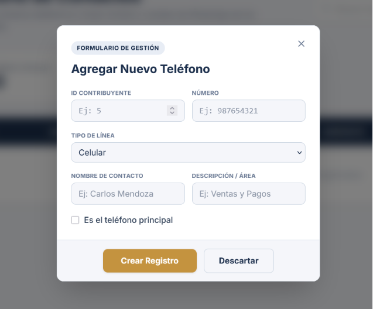

# 🏦 SISTEMA FINANCIERO CORPORATIVO
# MANUAL DE USUARIO Y OPERACIONES (VERSIÓN EXTENDIDA)

Este documento es la guía definitiva y obligatoria para todos los empleados, auditores y administradores que interactúan con el Sistema Financiero Corporativo. Aquí encontrarás documentado, campo por campo y pantalla por pantalla, el 100% de la funcionalidad del sistema.

---

## 📖 ÍNDICE DE CONTENIDOS

1. [CAPÍTULO 1: INTRODUCCIÓN Y CONCEPTOS BÁSICOS](#capítulo-1-introducción-y-conceptos-básicos)
2. [CAPÍTULO 2: ACCESO Y NAVEGACIÓN](#capítulo-2-acceso-y-navegación)
3. [CAPÍTULO 3: MÓDULO DE CAJA Y MOVIMIENTOS (CAJEROS)](#capítulo-3-módulo-de-caja-y-movimientos-cajeros)
4. [CAPÍTULO 4: GESTIÓN INTEGRAL DE CONTRIBUYENTES](#capítulo-4-gestión-integral-de-contribuyentes)
5. [CAPÍTULO 5: BANDEJA DE APROBACIONES (ADMINISTRADOR)](#capítulo-5-bandeja-de-aprobaciones-administrador)
6. [CAPÍTULO 6: CONFIGURACIÓN CENTRAL (ADMINISTRADOR)](#capítulo-6-configuración-central-administrador)
7. [CAPÍTULO 7: RESOLUCIÓN DE PROBLEMAS FRECUENTES (FAQ)](#capítulo-7-resolución-de-problemas-frecuentes-faq)

---

## 🏛️ CAPÍTULO 1: INTRODUCCIÓN Y CONCEPTOS BÁSICOS

El Sistema Financiero Corporativo es una plataforma web centralizada (`React + Vite + TypeScript`) diseñada para llevar el control estricto del flujo de dinero (ingresos y egresos), la base de datos de clientes/proveedores, y la arquitectura organizativa de una empresa con múltiples sucursales (Sedes) y personerías jurídicas (Empresas).

### Jerarquía de Roles
El sistema está rigurosamente dividido en dos niveles de seguridad:
1. **Administrador (Nivel 1):** Acceso irrestricto. Puede crear usuarios, configurar empresas, crear nuevas cajas, establecer series de facturación y **es el único que puede aprobar transacciones financieras sensibles**.
2. **Cajero / Operador (Nivel 2):** Perfil operativo. Su labor es atender operaciones diarias, registrar movimientos en su caja asignada, y crear perfiles de nuevos contribuyentes (clientes). Sus egresos importantes requieren autorización.

### Glosario del Sistema
* **Sede:** Ubicación física de la sucursal (ej. Oficina Miraflores).
* **Empresa:** Razón Social / RUC con la que opera financieramente un brazo del grupo.
* **Tipo de Caja:** Clasificación del dinero (Caja Efectivo, Cuenta Corriente Banco X, Caja Fuerte).
* **Contribuyente:** Cualquier persona natural o jurídica que da o recibe dinero de nosotros (Cliente, Proveedor, Empleado).
* **Movimiento:** Una transacción. Puede ser Ingreso (suma saldo) o Egreso (resta saldo).

---

## 🔑 CAPÍTULO 2: ACCESO Y NAVEGACIÓN

### 2.1. Inicio de Sesión (Login)
* Ingresa a la URL del sistema.
* **Correo Electrónico:** Ingresa el correo corporativo registrado por RRHH.
* **Contraseña:** Si es tu primer ingreso, usa la contraseña temporal entregada por tu administrador.
* El sistema encripta la comunicación de punta a punta.

### 2.2. Anatomía de la Pantalla
El sistema se compone de tres áreas principales:
1. **Barra de Navegación Lateral (Menú):** Ubicada a la izquierda. Se adapta a tu rol. El Admin verá "Configuración", el Cajero no.
2. **Barra Superior (Header):** Muestra tu nombre, tu Rol, y el botón de cerrar sesión.
3. **Área de Trabajo:** El cuerpo central donde ocurren las operaciones.

### 2.3. Estándar de Ventanas Emergentes (Modales)
En este sistema, no necesitas ir de página en página para hacer cambios simples.
Cuando quieras crear o editar algo (un usuario, un número de teléfono), se abrirá un **Modal**.
* Todo modal tiene el texto gris `FORMULARIO DE GESTIÓN`.
* Posee un botón mostaza para **GUARDAR** y un botón claro para **DESCARTAR** (cancelar sin hacer cambios).
* **¡Importante!** Si haces clic fuera del modal (en el fondo oscuro), el modal **no** se cerrará. Esto previene que pierdas datos si haces clic por accidente. Debes presionar explícitamente "Descartar" o la "X".

---

## 💵 CAPÍTULO 3: MÓDULO DE CAJA Y MOVIMIENTOS (CAJEROS)

Este es el módulo donde trabajarán los cajeros el 90% de su turno.

### 3.1. Cajero Dashboard
Al entrar, el cajero ve su resumen diario:
* **Saldo Inicial:** Con cuánto dinero abrió la caja hoy.
* **Ingresos del Día:** Sumatoria de depósitos / cobranzas.
* **Egresos del Día:** Sumatoria de pagos a proveedores o retiros.
* **Saldo Actual:** El dinero que físicamente debe haber en el cajón o cuenta bancaria vinculada.

### 3.2. Registro de Nuevo Movimiento
Para ingresar una operación, haz clic en **"Registrar Movimiento"**. Debes llenar **ESTRICTAMENTE** los siguientes campos:
1. **Tipo de Movimiento:** Selecciona `INGRESO` o `EGRESO`.
2. **Monto:** Introduce el valor numérico (no se aceptan montos negativos).
3. **Moneda:** Soles (PEN) o Dólares (USD).
4. **Contribuyente:** Usando un buscador integrado, escribe el DNI o RUC del cliente/proveedor. El sistema autocompletará el nombre.
5. **Tipo de Comprobante:** Selecciona si es Factura, Boleta, Recibo de Egresos, o Sin Comprobante.
6. **Número de Comprobante:** Si aplica, ingresa la serie y correlativo físico (Ej. `F001-000034`).
7. **Concepto / Observaciones:** Describe *por qué* está ingresando o saliendo el dinero (Ej. "Pago por mantenimiento de aire acondicionado del mes de Julio").

*Nota: Dependiendo de las reglas dictadas por gerencia, si el monto del EGRESO supera el límite de autorización de la caja, el sistema bloqueará el dinero pero el movimiento quedará en estado `PENDIENTE`. El dinero no se da físicamente hasta que el Administrador lo apruebe.*

---

## 📇 CAPÍTULO 4: GESTIÓN INTEGRAL DE CONTRIBUYENTES

El menú "Contribuyentes" concentra la información de las personas/empresas externas al sistema.

### 4.1. Listado Principal de Contribuyentes
* Contiene una barra de búsqueda inteligente.
* Puedes ver el ID, RUC/DNI, Razón Social, Correo y Estado.
* Haz clic en "Agregar Contribuyente" para registrar uno nuevo. Debes ingresar su DNI, consultar sus nombres (si hay conexión a RENIEC/SUNAT habilitada), correo, y dirección fiscal.

### 4.2. Módulo de Teléfonos
Guarda el directorio de contacto de clientes/proveedores.
* **ID Contribuyente:** Se vincula automáticamente o debes ingresarlo.
* **Número:** El número telefónico (ej. 987654321).
* **Tipo de Línea:** Celular, Fijo, WhatsApp, u Otro.
* **Nombre de Contacto:** El nombre de la persona dueña de la línea (muy útil en empresas grandes).
* **Descripción / Área:** Para qué es este teléfono (ej. "Área de Cobranzas").
* **Checkbox Principal:** Marca esto si es el teléfono de emergencias o contacto oficial.

### 4.3. Módulo de Documentos
Archivero digital. Aquí se cargan PDFs o imágenes importantes vinculadas al contribuyente.
* **ID Contribuyente:** Propietario del archivo.
* **Nombre del Documento:** Título descriptivo (ej. "Contrato Marco 2026").
* **Tipo (ID):** Seleccionar si es Ficha RUC, Contrato Comercial, etc.
* **Rubro (ID):** Opcional, vincularlo a un área económica.
* **Archivo Adjunto:** Botón para cargar el archivo físico desde tu PC. El archivo quedará almacenado de manera segura en el servidor.

### 4.4. Módulo de Credenciales
(Exclusivo para accesos confidenciales, usualmente manejados por contabilidad).
* Permite almacenar usuarios y claves de plataformas del estado o privadas vinculadas al cliente (Clave SOL SUNAT, AFP Net).
* **Campos:** Sistema/Entidad, Usuario Acceso, Contraseña, Observaciones, Estado Operativo (Activo/Inactivo).
* *Por auditoría, cada vez que un cajero o administrador visualiza la contraseña, el sistema registra el evento.*

### 4.5. Módulo de Tipos de Documento
Configuración interna. Permite declarar **qué** documentos se permiten en el sistema.
* **Nombre del Tipo:** Ej. "Certificado de Dominio".
* **Descripción:** Para qué sirve.
* **Formatos Permitidos:** Define qué archivos se pueden subir (ej. `.pdf, .jpg, .png`). Intentar subir un `.exe` o archivo no listado generará un error.
* **Obligatorio:** Seleccionar SÍ o NO (Indica si el sistema no dejará procesar al contribuyente si le falta este documento).

### 4.6. Módulo de Rubros Comerciales
Clasifica financieramente al contribuyente, especialmente útil para impuestos.
* **Nombre del Rubro:** Ej. "Transporte de Carga".
* **Código SUNAT:** Ej. "027". Importante para facturación electrónica.
* **Tasa de Detracción:** Permite elegir (4%, 9%, 10%, 12%, No Sujeto). Así, si un Cajero paga a este contribuyente, el sistema puede alertar que debe retener un porcentaje.

---

## 🛡️ CAPÍTULO 5: BANDEJA DE APROBACIONES (ADMINISTRADOR)

Si eres Administrador, tienes una vista crítica llamada `Aprobaciones de Movimientos`.

1. **La Bandeja de Pendientes:** Todos los egresos que superen ciertos límites o pagos específicos ingresados por los cajeros caen aquí.
2. **Auditoría Previa:**
   * Haz clic en ver detalles del movimiento.
   * Revisa quién lo solicitó (Cajero).
   * Revisa el comprobante físico adjuntado.
   * Verifica los documentos del Contribuyente para asegurarse de que todo está en regla.
3. **Decisión:**
   * **BOTÓN APROBAR:** El dinero se descuenta de la caja. El Cajero recibe luz verde.
   * **BOTÓN RECHAZAR:** Debes escribir un motivo obligatorio (Ej. "La factura adjunta está borrosa, pedir nueva al proveedor"). El Cajero recibirá el rechazo.

---

## ⚙️ CAPÍTULO 6: CONFIGURACIÓN CENTRAL (ADMINISTRADOR)

Para que el Cajero pueda trabajar, el Administrador primero debe armar la "estructura" del negocio. Estos módulos se operan de arriba hacia abajo:

### 6.1. Gestión de Empresas (`AdminEmpresasPage`)
* Define bajo qué razones sociales opera tu corporación.
* **Datos a agregar:** Razón Social, RUC, Dirección, Representante Legal, Teléfono y Estado.

### 6.2. Gestión de Sedes (`AdminSedesPage`)
* Son los establecimientos físicos donde trabaja tu personal.
* **Datos a agregar:** Nombre de Sede (ej. "Principal San Isidro"), Ubicación (dirección exacta), Empresa Asociada (cada sede pertenece a una empresa).

### 6.3. Gestión de Cajas (`AdminBoxTypesPage`)
* Las "bóvedas" lógicas del sistema.
* **Datos a agregar:** Nombre de la caja (ej. "Ventanilla 1", "Caja Fuerte"), Moneda (Soles o Dólares), Empresa vinculada, Sede vinculada, Saldo de Apertura Inicial.
* Puedes tener cajas inactivas (ej. una cuenta de banco cerrada).

### 6.4. Configuración de Comprobantes (`AdminComprobantesPage`)
* Alimenta el selector de recibos del Cajero.
* **Datos a agregar:** Tipo (Factura, Boleta, Recibo de Egresos), Serie (Ej. `F001`, `B002`), Sede a la que pertenece esa serie.

### 6.5. Gestión de Usuarios (`AdminUsersPage`)
* Control de acceso humano al sistema.
* Haz clic en **Agregar Usuario**.
* **Identificación:** Selecciona si es DNI, CE o Pasaporte y escribe el número.
* **Nombres y Apellidos:** Datos personales del empleado.
* **Correo:** Para acceso y notificaciones.
* **Rol de Acceso:** Decide su jerarquía. `Administrador` o `Cajero / Operador`.
* **Sede Asignada:** Fundamental. Un cajero asignado a la "Sede Surco" NO podrá ver la caja ni el dinero de la "Sede San Borja".
* **Contraseña:** Asígnale una contraseña temporal.

---

## 🆘 CAPÍTULO 7: RESOLUCIÓN DE PROBLEMAS FRECUENTES (FAQ)

**1. Hago clic en "Guardar" y el botón se queda girando (cargando) y no pasa nada.**
* *Solución:* Verifica tu conexión a internet. El sistema posee *Skeletons* (pantallas de carga grises) que te avisan si la red es lenta. Si demora más de 10 segundos, recarga la página (F5).

**2. Soy Cajero y necesito crear un nuevo tipo de Documento (Ej. "Carnet de Sanidad").**
* *Solución:* Por reglas del sistema, el Cajero no puede crear reglas globales de negocio. Debes solicitar a tu Administrador que ingrese a `Tipos de Documento` y lo cree por ti.

**3. Registré un Egreso y el dinero no se descontó de mi saldo.**
* *Solución:* El movimiento probablemente esté "Pendiente de Aprobación". Comunícate con tu Administrador para que revise su Bandeja de Aprobaciones. Una vez aprobado, tu saldo bajará inmediatamente.

**4. No encuentro el número de DNI de un cliente al buscarlo para registrar un pago.**
* *Solución:* El cliente no existe en la base de datos local. Dirígete a `Menú -> Contribuyentes -> Directorio` y haz clic en "Agregar Contribuyente". Tras guardarlo, ya aparecerá en la caja.

---
_Manual oficial del sistema. Queda estrictamente prohibida su divulgación a personal no autorizado. Desarrollado con los más altos estándares de seguridad y encriptación._
# cajas

