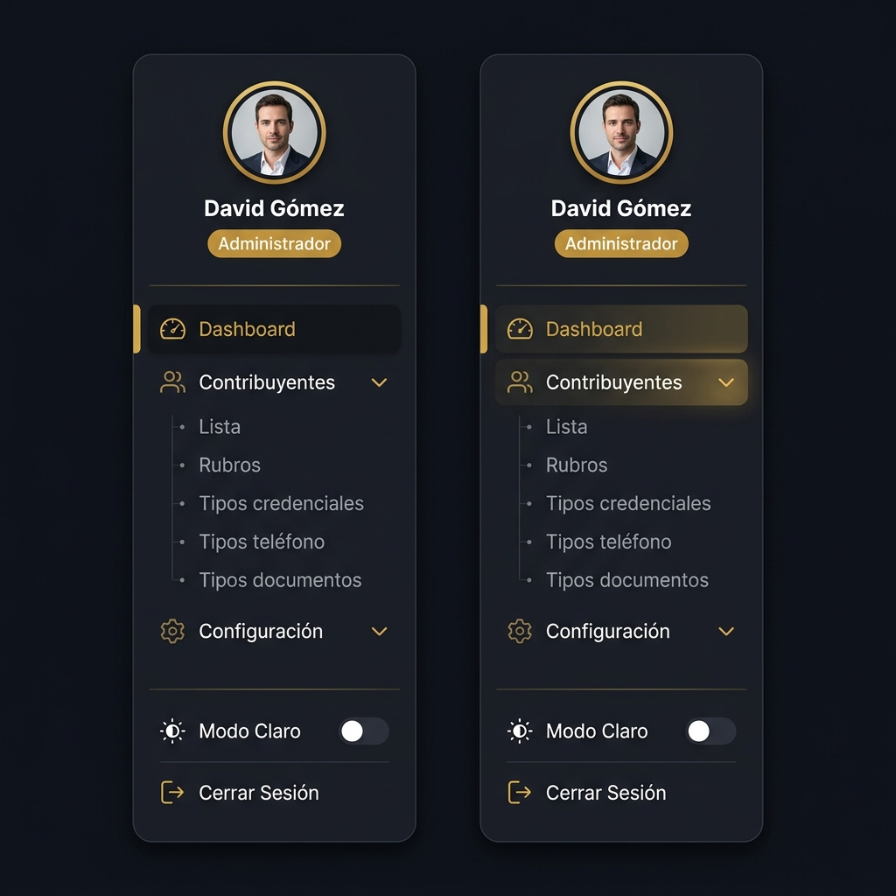
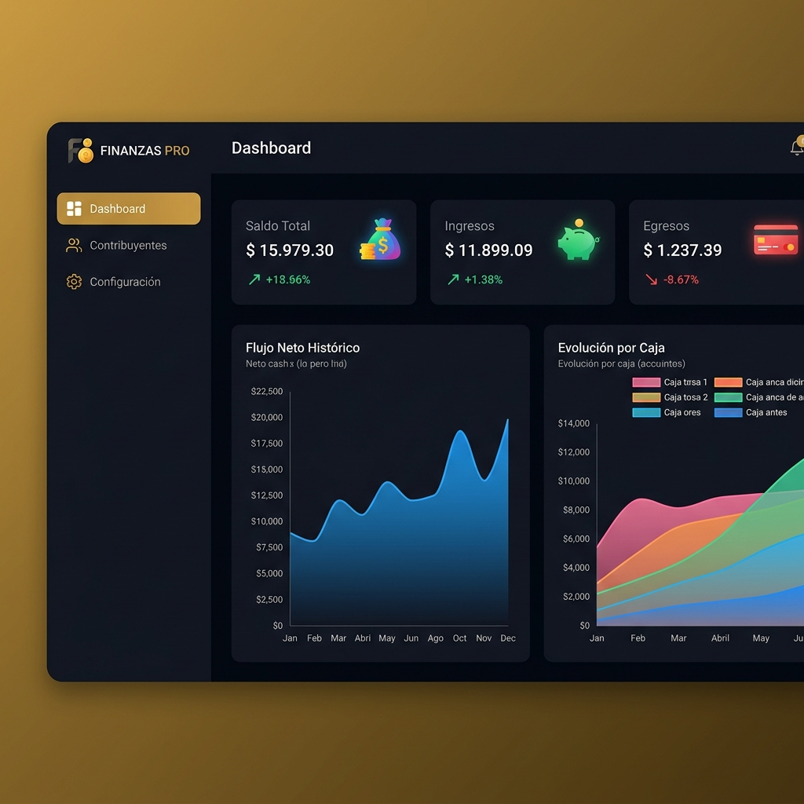
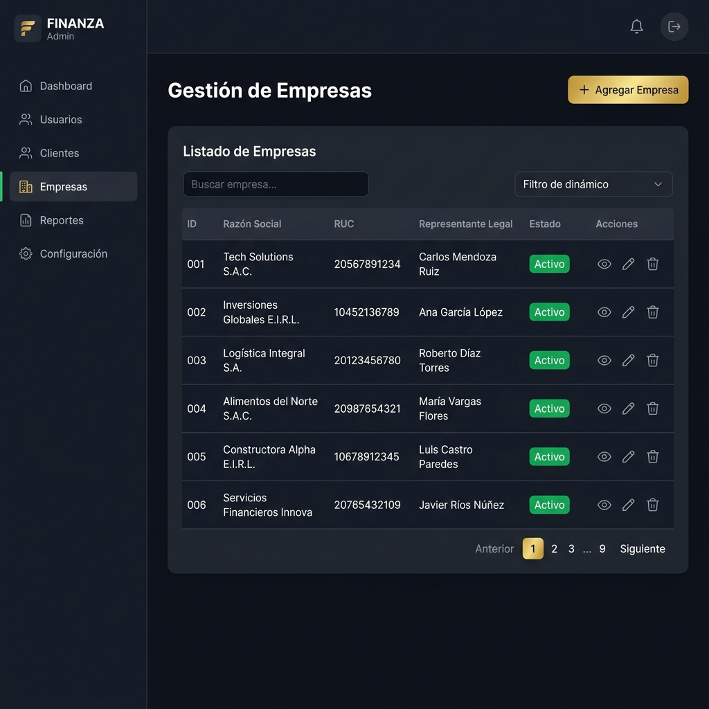
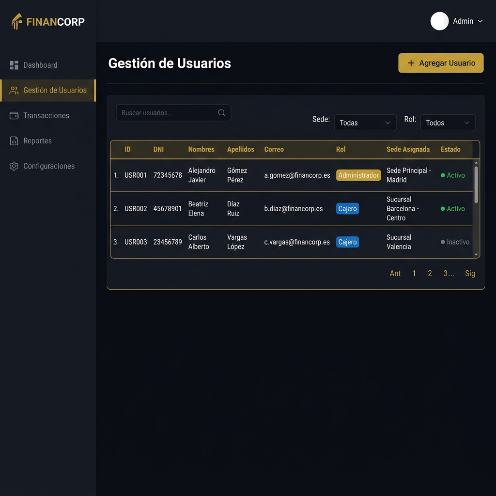
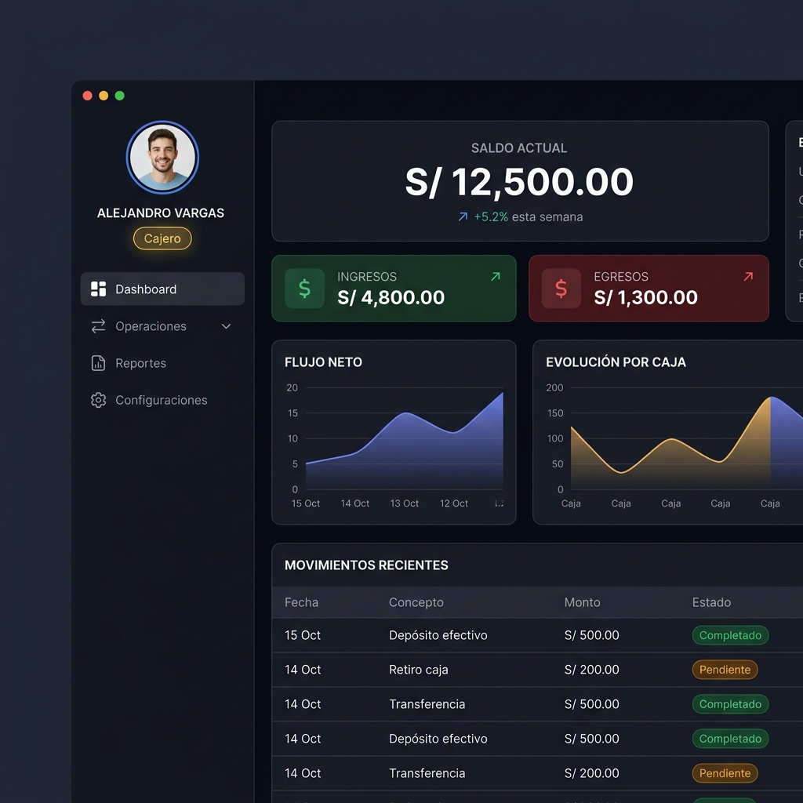
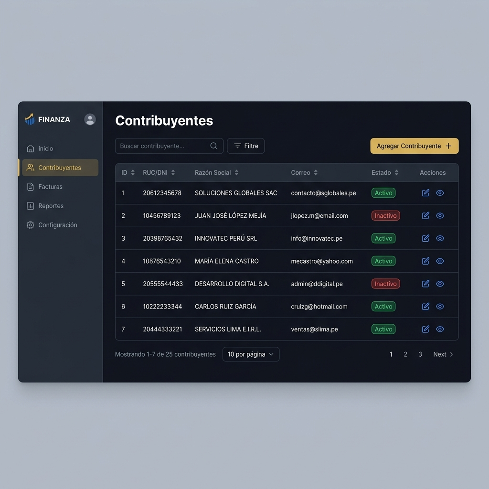
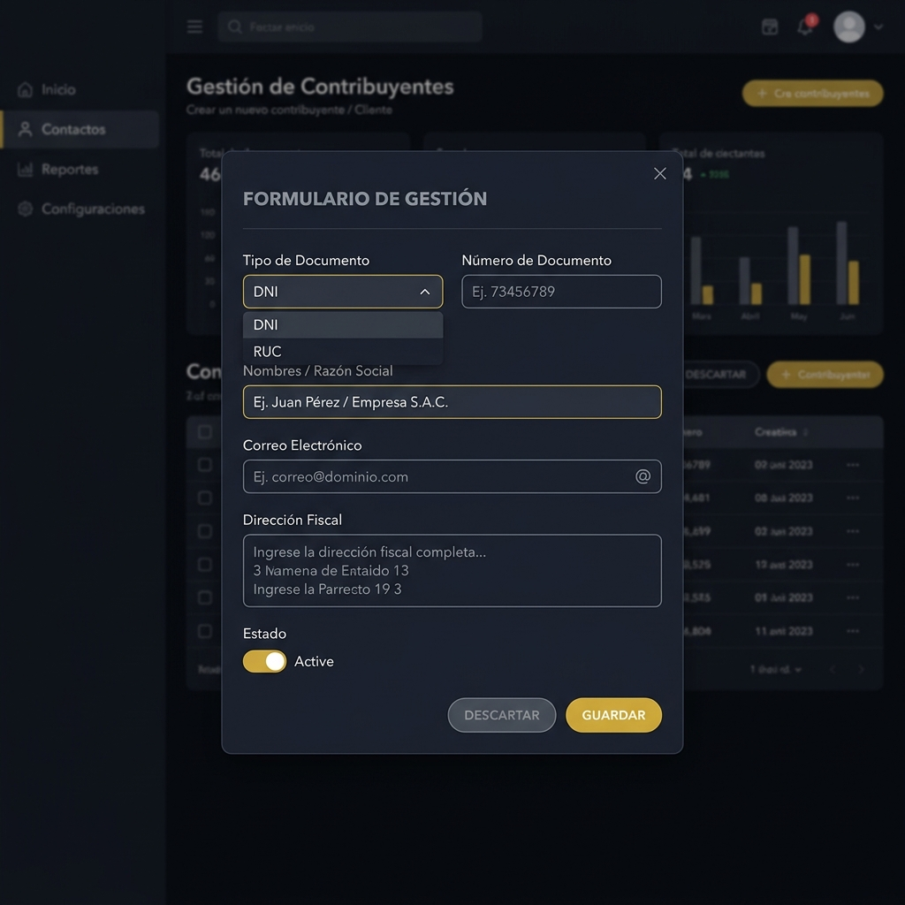
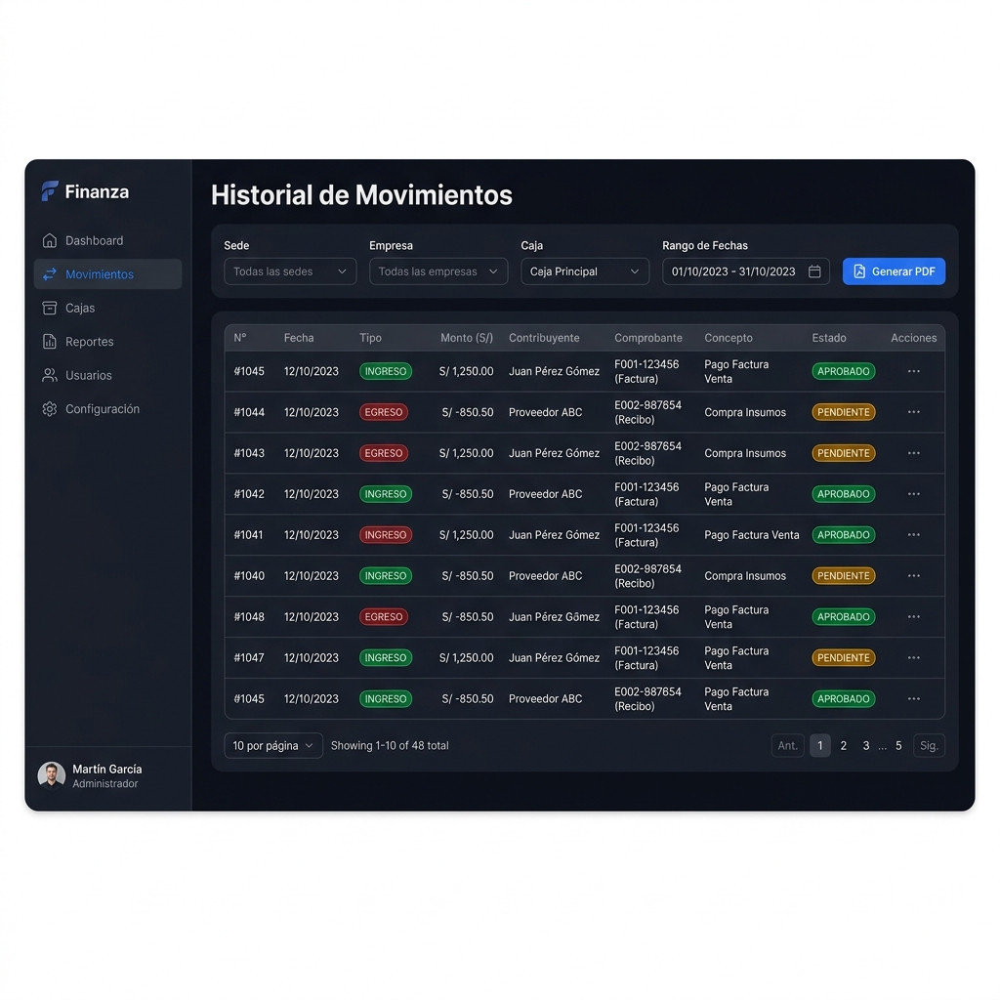
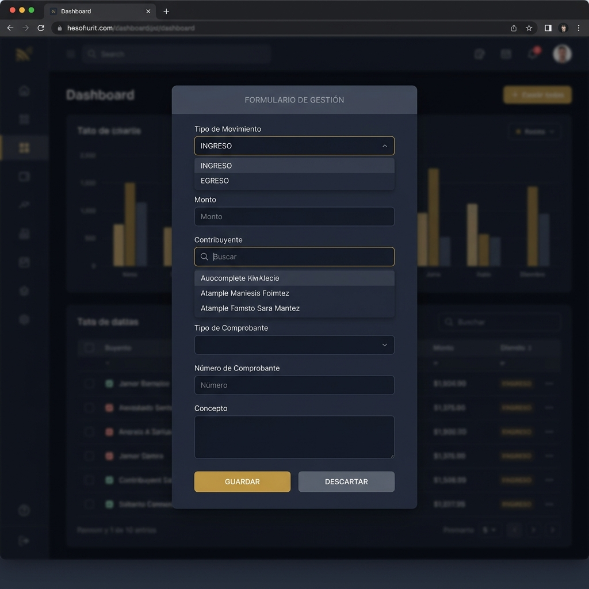
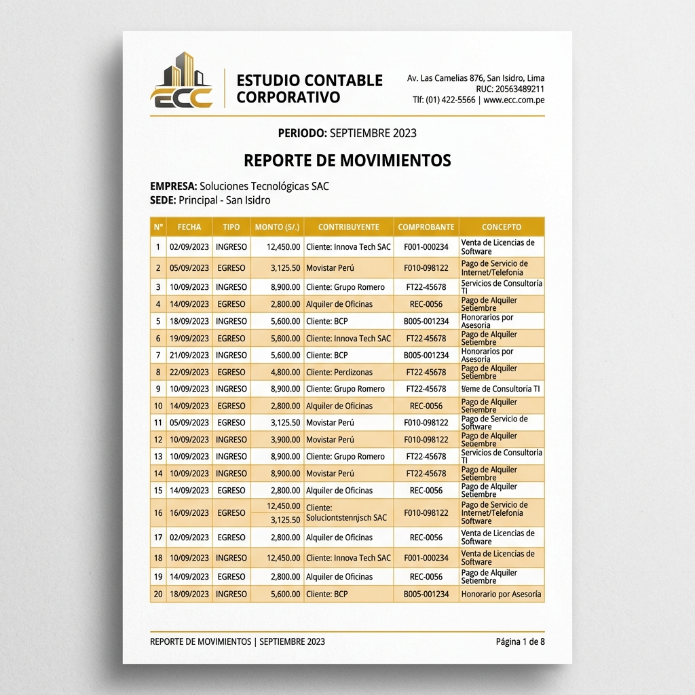

<div align="center">

# 🏦 SISTEMA FINANCIERO CORPORATIVO

### Manual de Usuario, Operaciones y Guía Técnica

[](https://react.dev/)
[](https://www.typescriptlang.org/)
[](https://vitejs.dev/)
[](https://tailwindcss.com/)

*Plataforma web centralizada para el control estricto de flujo de dinero, gestión de contribuyentes y administración multi-sede, fuertemente jerarquizada por niveles de acceso.*

</div>

---

## 📖 ÍNDICE DE CONTENIDOS

| N° | Capítulo | Descripción |
|----|----------|-------------|
| 1 | [Introducción y Glosario Extendido](#-capítulo-1-introducción-y-glosario-extendido) | Arquitectura del sistema y términos clave |
| 2 | [Acceso y Recuperación de Contraseña](#-capítulo-2-acceso-y-recuperación-de-contraseña-login) | Autenticación segura y restablecimiento de claves |
| 3 | [Nivel 1: Administrador (Gerencia)](#-capítulo-3-nivel-1-administrador-gerencia) | Control global, configuración y creación de catálogos |
| 4 | [Nivel 2: Cajero / Operador](#-capítulo-4-nivel-2-cajero--operador) | Registro de dinero y restricciones por sede |
| 5 | [Módulo Universal de Contribuyentes](#-capítulo-5-módulo-universal-de-contribuyentes) | Directorio, credenciales y documentos (Ambos niveles) |
| 6 | [Módulo de Movimientos (Ingresos y Egresos)](#-capítulo-6-módulo-de-movimientos-ingresos-y-egresos) | Historial financiero y registro de tickets |
| 7 | [Reportes y Exportación](#-capítulo-7-reportes-y-exportación-pdfexcel) | Generación de PDFs y Excel con membrete |
| 8 | [Guía Técnica para Desarrolladores](#-capítulo-8-guía-técnica-para-desarrolladores) | Stack, instalación y rendimiento |
| 9 | [Preguntas Frecuentes (FAQ)](#-capítulo-9-preguntas-frecuentes-faq) | Solución de problemas comunes |

---

## 🏛️ CAPÍTULO 1: INTRODUCCIÓN Y GLOSARIO EXTENDIDO

El **Sistema Financiero Corporativo** ha sido diseñado bajo una arquitectura de seguridad estricta basada en **Niveles Jerárquicos**. Esto garantiza que cada usuario visualice e interactúe únicamente con la información para la que ha sido autorizado.

### 1.1. Los Dos Niveles del Sistema

Todo el sistema gira en torno a estos dos perfiles fundamentales:

| Área de Operación | 👑 NIVEL 1: ADMINISTRADOR (Gerencia) | 👷 NIVEL 2: CAJERO / OPERADOR (Trinchera) |
|-------------------|--------------------------------------|-------------------------------------------|
| **Visibilidad** | **Global:** Tiene acceso a los saldos, gráficos de flujo y todas las transacciones de **absolutamente todas las sedes** y empresas. | **Restringida:** Un cajero tiene asignada **una o más sedes**. Solo podrá ver la información financiera de esas sedes. Todo lo que ocurra fuera de ellas es invisible. |
| **Configuración** | **Estratégica:** Único perfil autorizado para crear nuevas Sedes, Empresas, Cajas Bancarias, Usuarios del sistema y Series de Comprobantes. | **Nula:** No tiene acceso a la estructura y catálogos de negocio. |
| **Operativa** | **Monitoreo y Auditoría:** Su rol principal es analizar flujos, no el día a día. | **Financiera Directa:** Registra **Ingresos y Egresos** de dinero en sus cajas. Sus registros impactan los saldos de forma inmediata, con total autonomía operativa. |
| **Gestión de Catálogos** | **Catálogos Base:** Único con acceso para añadir Tipos de Documento, Tipos de Teléfono, Tipos de Credencial y Rubros Comerciales. | **Consumidor:** Usa los catálogos creados por el administrador pero no puede inventar nuevos. |
| **Contribuyentes (CRM)** | **Administrador:** Puede crear y administrar el directorio completo de Contribuyentes. | **Gestión Avanzada:** Al igual que el Admin, el Cajero puede crear contribuyentes, gestionar sus credenciales, agregar teléfonos y subir documentos PDF/JPG. |

---

### 1.2. Glosario Extendido del Sistema

Comprender la terminología es clave para la correcta operación del software.

| Término | Definición Técnica y Operativa |
|---------|--------------------------------|
| **Sede** | Localización física o lógica (ej. "Oficina Miraflores", "Sede Central"). Actúa como un muro de contención: los datos de una sede no se mezclan con los de otra. Un cajero puede tener varias sedes asignadas. |
| **Empresa (Razón Social)** | Entidad legal con RUC. El sistema soporta operaciones de múltiples razones sociales simultáneamente bajo un mismo paraguas corporativo. |
| **Tipo de Caja** | Cuentas financieras (ej. "Efectivo", "BCP Soles", "BBVA Dólares"). El saldo de la Sede es la suma de los saldos de todas sus Cajas. |
| **Contribuyente** | Cualquier persona natural (DNI) o jurídica (RUC) que interactúa con la empresa. Abarca tanto a *Clientes* (que pagan) como a *Proveedores/Empleados* (a los que se les paga). |
| **Movimiento** | Registro individual de dinero. Puede ser **Ingreso** (suma saldo a la caja) o **Egreso** (resta saldo a la caja). |
| **Credenciales** | Sistema tipo "Caja Fuerte" donde se almacenan claves confidenciales (Clave SOL, Portal Bancario, etc.) de los contribuyentes. Las vistas de contraseñas son auditadas. |
| **Documento Digital** | Archivo en la nube adjunto al perfil de un contribuyente (Fichas RUC, DNI escaneado, contratos, etc). |
| **Rubro Comercial** | Clasificación económica del contribuyente que define su actividad (Ej. Minería, Servicios), usado muchas veces para determinar tasas de retención o detracción SUNAT. |

---

## 🔑 CAPÍTULO 2: ACCESO Y RECUPERACIÓN DE CONTRASEÑA (LOGIN)

La puerta de entrada a la plataforma cifra los datos punto a punto para garantizar máxima privacidad financiera.

<div align="center">


*Interfaz limpia y profesional de autenticación*

</div>

### 2.1. Ingreso Inteligente
1. El usuario ingresa su correo electrónico corporativo y su contraseña de seguridad.
2. El sistema valida si el usuario está **Activo**, determina automáticamente su **Nivel (Admin o Cajero)** y averigua **qué sedes** tiene asignadas.
3. El sistema redirige automáticamente al Dashboard correspondiente.

### 2.2. ¿Olvidaste tu contraseña? (Recuperación)
Para evitar que un cajero quede bloqueado por olvido de credenciales:
1. En la pantalla de login, se hace clic en el enlace **"¿Olvidaste tu contraseña?"**.
2. Se solicitará el correo electrónico registrado en el sistema.
3. El sistema enviará un **correo de recuperación con un enlace seguro** para que el usuario pueda crear una nueva contraseña y volver a ingresar inmediatamente, sin depender del Administrador en fines de semana o feriados.

---

## 👑 CAPÍTULO 3: NIVEL 1 - ADMINISTRADOR (GERENCIA)

El panel del administrador representa el **Centro de Mando**. La interfaz de navegación (Sidebar) se habilita en su totalidad, mostrando los paneles de configuración y control maestro.

<div align="center">


*El menú lateral del Administrador despliega configuraciones inaccesibles para el Cajero*

</div>

### 3.1. Dashboard Global
El panel de inteligencia de negocios cruzando datos locales a velocidad ultra-rápida. Muestra:
- **Capital Total Consolidado:** Suma de todas las cajas en la corporación (todas las sedes).
- **Flujo Neto:** Ingresos vs Egresos del día.
- **Gráficos Expandibles:** Gráficas de área (Flujo Histórico y Evolución por Caja) con degradados interactivos, totalmente clicables.
- **Donas de Distribución:** ¿Qué sede concentra más liquidez? ¿Qué empresa (RUC) tiene más saldo?

<div align="center">


*Visualización de gráficas financieras globales*

</div>

### 3.2. Módulo de Configuraciones (Acceso Exclusivo)
Bajo la pestaña **"Configuración"**, el Admin estructura el esqueleto del negocio:

- **Empresas:** Registrar y editar Razones Sociales y sus números de RUC.
- **Sedes:** Activar o desactivar sucursales.
- **Tipos de Caja:** Crear cuentas corrientes o bóvedas y anclarlas a una Sede en específico y con una moneda base.
- **Usuarios:** Creación de nuevos trabajadores (Nivel 1 o Nivel 2). Aquí se decide a qué **Sedes específicas** tendrá acceso el Cajero.
- **Comprobantes:** Definir qué series y tipos de documentos (Facturas, Boletas, Recibos) operarán en cada sede.

<div align="center">


*Módulo de configuración de Empresas (Razones Sociales)*


*Gestión de Usuarios y asignación de múltiples sedes*

</div>

---

## 👷 CAPÍTULO 4: NIVEL 2 - CAJERO / OPERADOR

La interfaz del cajero es operativa, priorizando la agilidad y el aislamiento por seguridad.

### 4.1. Dashboard de Sede
A diferencia del Administrador, la pantalla inicial del Cajero:
- Solo muestra los saldos totales de **la sede (o sedes) a la que fue asignado**.
- Los gráficos ignoran completamente los movimientos económicos de las sedes externas a su perfil.
- Le permite verificar el cierre de su propia caja de manera rápida y sin ruido visual exterior.

<div align="center">


*Vista del Cajero enfocada en su sede asignada*

</div>

---

## 📇 CAPÍTULO 5: MÓDULO UNIVERSAL DE CONTRIBUYENTES

Es un CRM robusto que gestiona todos los actores externos de la empresa.
**Tanto el Nivel 1 (Admin) como el Nivel 2 (Cajero) pueden operar libremente en la creación y administración de Contribuyentes y su data anidada.**

<div align="center">


*Directorio interactivo de contribuyentes (DNI/RUC)*


*Registro de contribuyente con campos esenciales*

</div>

### 5.1. Operaciones sobre el Contribuyente (Nivel 1 y Nivel 2)
Al entrar al perfil de un cliente/proveedor, ambos roles tienen poder para gestionar:

| Sub-módulo | Acción permitida |
|------------|------------------|
| **Teléfonos** | Agregar números celulares, fijos, marcar el canal principal de comunicación. |
| **Documentos Digitales** | Subir PDFs o Imágenes al repositorio (Contratos, Ficha RUC, DNI escaneado). El sistema los guarda en la nube para acceso futuro. |
| **Credenciales** | Almacenar usuarios y contraseñas (ej. Clave SOL, Accesos web). El sistema audita silenciosamente quién "destapa" la clave. |

### 5.2. Catálogos del Contribuyente (Exclusivo Nivel 1)
Aunque el Cajero crea contribuyentes, solo el **Administrador** puede modificar las reglas base en los submenús del sidebar:
- Crear nuevos **Rubros** Comerciales.
- Añadir nuevos **Tipos de Credenciales**.
- Añadir **Tipos de Teléfonos**.
- Añadir **Tipos de Documento**.

---

## 💵 CAPÍTULO 6: MÓDULO DE MOVIMIENTOS (INGRESOS Y EGRESOS)

La bitácora contable de la empresa, donde se registra la historia financiera en tiempo real.

<div align="center">


*La tabla de transacciones muestra ingresos (verde) y egresos (rojo)*

</div>

### 6.1. Historial y Tabla
- **Administrador:** Ve todos los movimientos de todas las sedes de la corporación. Puede usar filtros combinados para rastrear dinero globalmente.
- **Cajero:** Ve exclusivamente la tabla de movimientos de las sedes que tiene asignadas.

### 6.2. Registro de Operaciones
El **Cajero (Nivel 2)** (y el Administrador si lo desea) puede registrar nuevas operaciones haciendo clic en "Nuevo Movimiento".

<div align="center">


*Formulario de Ingreso/Egreso*

</div>

1. Se indica el **Monto**.
2. Se selecciona si es un **INGRESO** (incrementa la caja) o **EGRESO** (resta de la caja).
3. Se selecciona la **Caja** (Ej. BCP Soles) de donde sale o entra.
4. Se busca al **Contribuyente**.
5. Se ingresa el N° de Comprobante (Factura/Boleta) y un concepto descriptivo.
6. Al dar Guardar, el saldo se actualiza automáticamente.

---

## 📑 CAPÍTULO 7: REPORTES Y EXPORTACIÓN (PDF/EXCEL)

El sistema integra un poderoso motor interno que arma reportes instantáneos (no se cuelga ni colapsa el navegador).

<div align="center">


*Exportación con membrete y cálculos automáticos de saldos*

</div>

- **Generación Local:** Al presionar "Exportar", la computadora arma el PDF o el Excel utilizando `jsPDF-autotable` y `ExcelJS`.
- **Estilo Corporativo:** Los PDFs llevan un membrete oficial de fondo (hoja pre-membretada) y separan con color verde/rojo los ingresos de los egresos, incluyendo los totales matemáticos en la parte inferior de cada sede.
- **Restricción de Nivel:**
  - El Cajero exporta el "Reporte de Cierre de Caja" solo de su sede.
  - El Administrador exporta el "Consolidado Global" con todas las sedes.

---

## 💻 CAPÍTULO 8: GUÍA TÉCNICA PARA DESARROLLADORES

### 8.1. Stack Tecnológico Moderno
| Tecnología | Versión | Uso Core |
|------------|---------|----------|
| **React** | 18.x | Librería frontend, uso intensivo de Hooks (`useState`, `useEffect`). |
| **TypeScript** | 5.x | Aporta seguridad previniendo errores de "undefined" y modelando interfaces como `Contribuyente` o `Movimiento`. |
| **Vite** | 5.x | Sustituto de Webpack. Arranque del servidor de desarrollo instantáneo. |
| **Tailwind CSS** | 3.x | Framework utilitario para diseño fluido. Permite el cambio a "Dark Mode" con un solo clic. |
| **Recharts** | 2.x | Biblioteca de Gráficos SVG interactivos y renderizado responsivo. |

### 8.2. Optimización de Rendimiento
Para evitar demoras (esqueletos infinitos de carga) en la pantalla inicial:
- **Cálculo en Memoria (0x Network Overhead):** El Dashboard descarga un *pool* masivo de transacciones una única vez, y luego el procesador del usuario realiza todos los filtros, cruces de Sedes, y métricas matemáticas a nivel local de forma **asíncrona pero inmediata** (< 2 ms). Esto reemplaza el anticuado enfoque de disparar múltiples peticiones API por cada caja o sede.

### 8.3. Instalación para Desarrollo
```bash
# 1. Clonar
git clone https://github.com/skyps2003/cajas.git

# 2. Entrar a carpeta
cd cajas

# 3. Descargar módulos (Node.js requerido)
npm install

# 4. Servir ambiente de prueba local
npm run dev

# Se abrirá: http://localhost:5173
```

---

## 🆘 CAPÍTULO 9: PREGUNTAS FRECUENTES (FAQ)

| Síntoma | Diagnóstico y Solución |
|---------|------------------------|
| **"Olvidé mi contraseña y soy el único cajero hoy"** | En la pantalla principal, presiona *"¿Olvidaste tu contraseña?"*. Te llegará un correo automático para crear una nueva al instante. |
| **"Soy cajero y me sale que no tengo cajas disponibles al intentar registrar un ingreso"** | Significa que el Administrador no ha creado ninguna caja física/bancaria activa asignada a tu Sede. Pide que lo hagan desde `Configuración -> Tipos de Caja`. |
| **"Quiero ingresar a la Sede Norte pero solo veo la Sede Sur"** | El sistema soporta que un Cajero tenga **Múltiples Sedes**, pero el Administrador debe asignártelas desde la sección `Usuarios`. |
| **"No encuentro el botón para agregar Rubros Comerciales"** | Solo el Nivel 1 (Administrador) tiene autorización para modificar el catálogo maestro de rubros o tipos de documentos. |
| **"¿El sistema funciona en mi teléfono celular?"** | Sí, el diseño es 100% responsivo. El menú lateral colapsa y las tablas muestran _scroll horizontal_ automático en pantallas pequeñas para que nada se descuadre. |

---

<div align="center">

**Sistema Financiero Corporativo** · Manual de Usuario V4.0  
Desarrollado para optimizar la seguridad jerárquica y velocidad operativa.  
*Manual redactado y estructurado según las políticas de acceso por Niveles.*

</div>